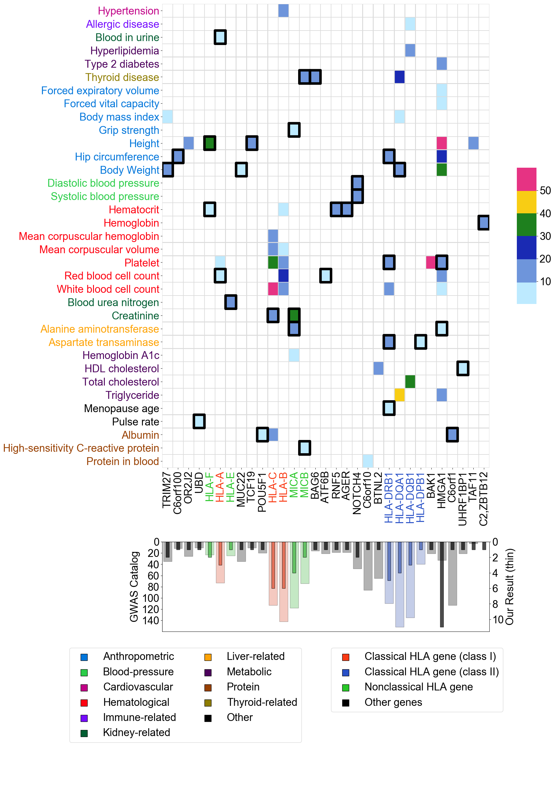
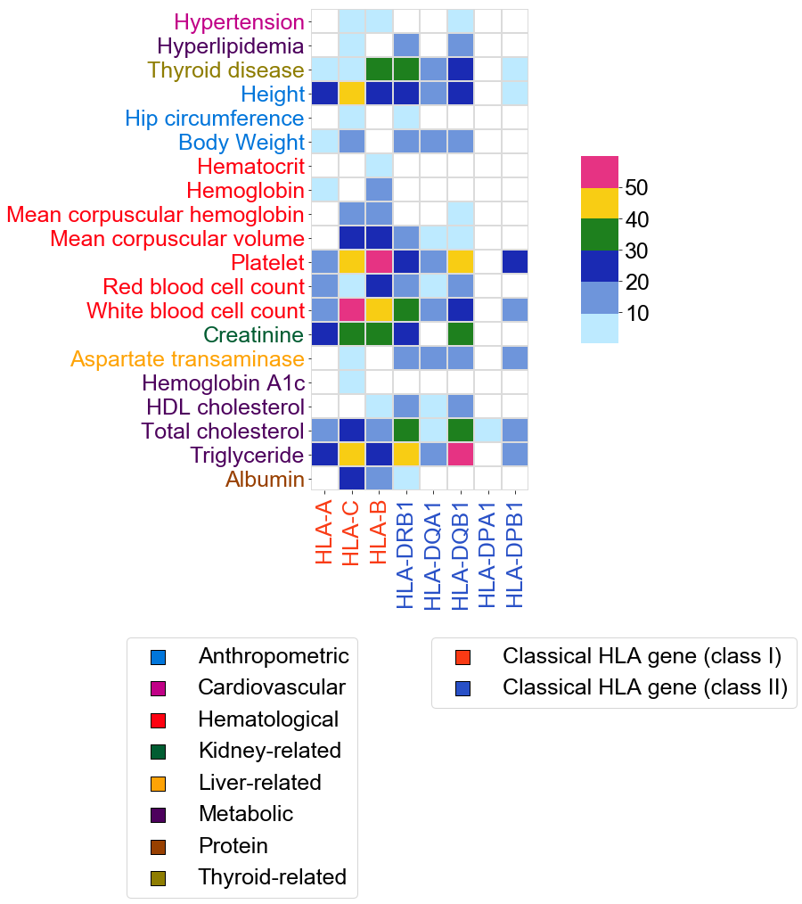
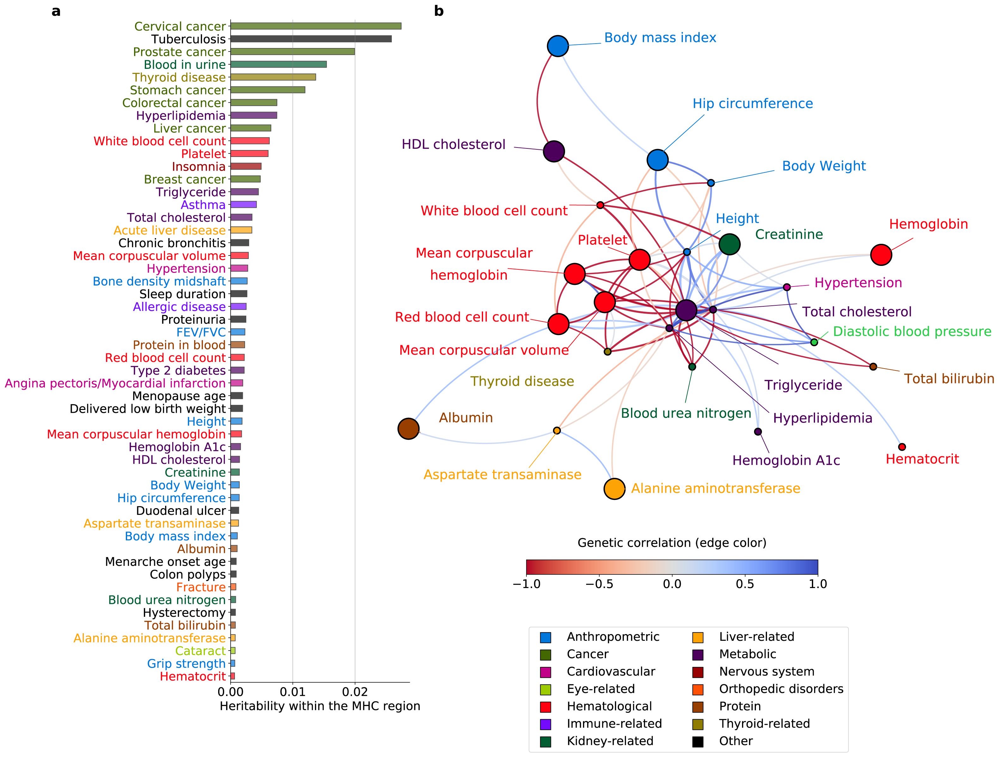
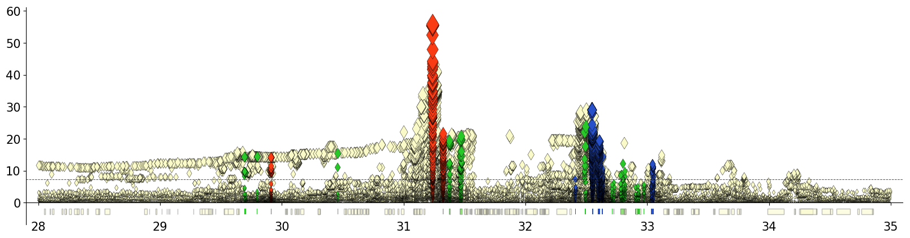
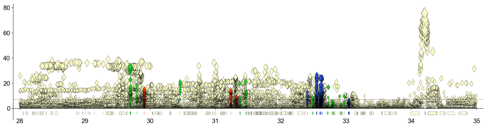

# Phenome-wide association study of the major histocompatibility complex region in the Korean population 

## Abstract

In this study, we comprehensively analyzed associations between phenotypes and genetic variants in MHC region for Korean population using the Korean Genome and Epidemiology Study (KoGES) data. This data consists of phenotype and genotype information of ~120,000 Korean individuals. The phenotypes include answers to an extensive set of questionnaires along with data from physical examinations and clinical investigations collected during the baseline and follow-up phases. The individuals were genotyped using the KCHIP (Korea Biobank Array), a microarray that was designed for Korean population. 

Using this new single-population dataset, we wanted to confirm already reported associations and discover novel associations between HLA variants and phenotypes. To this end, we curated 97 overlapping phenotypes across 4 cohorts in KoGES. We imputed genotypes of 8 classical HLA genes, which comprised a total of 119 alleles. We defined markers for the 4-digit HLA alleles, amino acid residues at 349 amino acid positions in 8 HLA genes, and 67,091 SNVs in the MHC region. We then conducted PheWAS to identify associations within the region to phenotypes. Our analysis confirmed significant associations identified in previous studies and found 36 novel association signals that were not reported previously. In addition, we analyzed heritability explained by variants in the MHC region and genetic correlations among phenotypes.

## Figures

## PheWAS result - Matrix of phenotype and gene assigned to association signal

## HLA variant Omnibus Test

## Heritability estimated in the entire MHC region and genetic correlation among phenotypes

# GWAS Manhattan Plot

## White blood cell count

## Height

# Software

- For genotype munge,
    - [Vcftools](http://vcftools.sourceforge.net/)
    - [Plink](www.cog-genomics.org/plink/2.0/)

- For HLA Imputation,
    - [CookHLA](https://github.com/WansonChoi/CookHLA)

- For HLA variant association test,
    - [GAT (Generic Genome-Wide Association Tool)](https://github.com/ch6845/GAT)

- For HLA variant munge,
    - [HATK(HLA Analysis Toolkit)](https://github.com/WansonChoi/HATK)

# Citation

Chanwoo Kim, et al. “Phenome-wide association study of the major histocompatibility complex region in the Korean population identifies novel association signals.” 
(Under preparation)